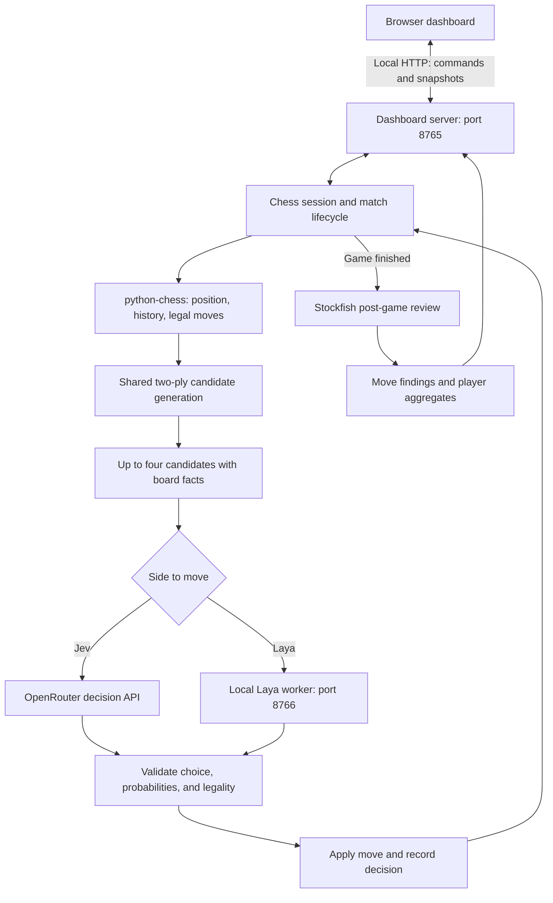

# Jev vs Laya

A local arena for comparing Jev and Laya through games. Chess is the first implemented game.

Watch two decision models play standard chess on a live board, inspect their choices, replay moves, and download PGNs. Both use identical lightweight candidate generation. Stockfish reviews finished games only.

## Quick start (Windows, Python 3.12)

```powershell
git clone https://github.com/aarush-dhingra/Jev-vs-Laya.git
cd Jev-vs-Laya
.\scripts\Install.ps1 -Models
.\scripts\Install-ChessEngine.ps1
# Set your OPENROUTER_API_KEY in .env
.\scripts\Start-Local.ps1
```

Open http://127.0.0.1:8765. Laya downloads its weights on first launch and uses CUDA when available, otherwise CPU. Jev calls require your own OpenRouter access. See [setup](docs/setup.md) for device configuration and troubleshooting.

Stop services with `.\scripts\Stop-Local.ps1`. Closing the browser does not stop play.

## Architecture

The application separates game rules, candidate generation, model decisions, presentation, and post-game evaluation. Python owns the authoritative board; the browser displays snapshots and sends control commands.



Stockfish has no connection to the live candidate-selection path. Both players receive candidates generated by the same lightweight implementation, and the active model chooses the final move. The default assisted mode checks that the reviewer is installed before starting, but runs its searches only after a completed game.

### Components

| Component | Responsibility | Source |
| --- | --- | --- |
| Rules and session | Authoritative board, legal move application, turn order, pause/stop, termination, recording, and color swaps | [chess_session.py](src/arena/chess_session.py) |
| Shared analysis | Two-ply search, handcrafted evaluation, tactical checks, candidate diversity, and board facts | [chess_analysis.py](src/arena/chess_analysis.py) |
| Provider adapters | Configuration, request budgets, HTTP transport, and response validation | [providers.py](src/arena/providers.py) |
| Laya worker | Loads the checkpoint once and serves serialized local inference requests | [laya_worker.py](src/arena/laya_worker.py) |
| Review engine | Starts Stockfish after the game and computes move-level findings | [chess_review.py](src/arena/chess_review.py) |
| Local HTTP server | Serves dashboard assets, SVG pieces, state, controls, and exports | [server.py](src/arena/server.py) |
| Browser client | Live board, move animation, replay, decision details, and review panels | [web/](src/arena/web/) |

The dashboard uses plain HTML, CSS, and JavaScript with HTTP polling. There is no frontend build step or database. Match artifacts are written to local files under `var/runs/`. The Laya worker is a separate resident process so the checkpoint does not reload on every turn.

### A turn, step by step

1. **Read the position.** The session copies the current board and its move history, preserving repetition information.
2. **Generate all legal moves.** `python-chess` handles checks, castling, en passant, and promotions.
3. **Examine immediate replies.** For each move, the shared evaluator considers every legal opponent reply and keeps the worst resulting score from the moving side's perspective. Two plies means one player move and one opponent reply.
4. **Score positions.** The evaluator combines material, central placement, pawn advancement, minor-piece development, rook advancement, and basic king placement. This is shallow handcrafted evaluation, without an opening book, tablebase, or deep search.
5. **Apply shared filters.** Immediate mates are prioritized. Moves allowing mate on the next reply are excluded when safer alternatives exist. When material is ahead by more than one pawn, repeats and immediate draw opportunities are avoided if a progress move remains.
6. **Build a diverse shortlist.** Select representatives from attack, defend, develop, and improve categories, then fill remaining slots by heuristic score, up to four candidates. Present the final set in UCI move order rather than score order.
7. **Ask the active model.** Jev or Laya selects from the supplied move identifiers. Both use the same observation and question structure.
8. **Validate and apply.** Check the selected identifier and probability distribution, verify legality again, apply the move, and record the decision. An invalid response fails the match rather than silently substituting a heuristic move.

The model observation includes:

- Current FEN and side to move.
- The last 12 half-moves in SAN.
- Current material balance and whether the position has repeated.
- Candidate SAN labels, tactical facts, and one possible immediate opponent reply per candidate.

Numeric heuristic scores remain in the local decision record for inspection; they are not sent to either model. Returned choice probabilities are model preferences over the supplied candidates, not calibrated winning probabilities.

### Model execution

| | Jev | Laya |
| --- | --- | --- |
| Default route | Hosted OpenRouter decision API | Local HTTP worker |
| Configured model | `typesafe/jev-1.13` | `convaiinnovations/laya`, `typed-decisions` subfolder |
| Runtime | Provider-managed | `laya==0.3.5` with PyTorch |
| Device | Remote service | CUDA when available, otherwise CPU |
| Decision input | Shared position facts and candidate choices | Shared position facts and candidate choices |

Laya uses the Python package and checkpoint listed above, not `mizorewww/laya-mlx`. The worker checks the checkpoint context limit and rejects oversized observations rather than silently truncating them. The optional direct TypeSafe route is described in the [setup guide](docs/setup.md).

### Match lifecycle and controls

- **Assisted mode:** shared lightweight search followed by one model selection per move.
- **Unassisted mode:** the model first selects a piece, then a legal move for that piece. This bounds the choice set without shared tactical candidate pruning.
- **Standard endings:** checkmate, stalemate, insufficient material, and rule-based draws use `python-chess`. Claimable threefold repetition and fifty-move draws are claimed automatically.
- **Limits:** defaults are 400 half-moves and 1,000 provider requests. Reaching a limit leaves a game unfinished; it does not award a win.
- **Timing:** games have no competitive chess clock. Displayed decision latency covers candidate preparation and model selection, including provider/network overhead, but excludes the configured display delay and post-game review.
- **Two-game series:** colors swap for the second game after the first game and its review finish.
- **Persistence:** a completed local game can be restored for viewing after restart; an interrupted match is not automatically resumed.

### Local service boundary

Both services bind to localhost. Dashboard commands require the local session token and validated host/origin headers; static assets are served from an explicit allowlist. Provider requests do not follow redirects. The worker rejects browser-origin inference requests. This is a local development application, not a hardened public hosting service.

## Post-game evaluation

Stockfish reviews the actual played positions after a game finishes. It does not decide the moves being compared.

For each move, the reviewer searches the position for its preferred move and separately searches with the played move forced. Searches use **depth 16 or 60,000 nodes**, one thread, a 64 MB hash, and a cleared hash between searches. If the played move already matches the first search's preferred move, the reviewer reuses that result and assigns zero loss.

Evaluations use the moving side's perspective:

```text
move loss = min(2000, max(0, best evaluation - played evaluation))
average centipawn loss = sum(move losses) / number of moves
```

Mate scores map to +/-100,000cp for this calculation. One pawn corresponds to 100 centipawns. Search limits can produce approximate or unstable evaluations; the zero floor and per-move cap are explicit reporting choices.

| Metric | Interpretation |
| --- | --- |
| Average centipawn loss | Mean capped evaluation loss against this review search; lower is better within this methodology |
| Engine first-choice matches | Number of played moves matching the reviewer's preferred move |
| Excellent / good | Loss <=20cp / >20cp and <=50cp |
| Inaccuracy | Loss >50cp and <=100cp |
| Mistake | Loss >100cp and <=200cp |
| Blunder | Loss >200cp |
| Missed forced mate | Best search sees a positive mate score while the played-move search does not |
| Allowed forced mate | Played-move search sees a negative mate score while the best search does not |
| Mean decision time | Average measured live decision latency for that player's moves |

Mate flags describe changes visible within the bounded search; they are not proofs about every continuation. A move can contribute both a loss classification and a mate flag. First-choice matches are not an accuracy percentage, and the project does not calculate custom accuracy scores, letter grades, or Elo estimates.

## Results

### Recorded development demonstration

The demonstration recorded during development ended with **Jev, playing White, winning by checkmate with `81. Bf3#`**. The game lasted **161 half-moves**: 81 Jev moves and 80 Laya moves. Both sides used the shared lightweight assistance pipeline; Stockfish supplied the post-game review.

| Measure | Jev (White) | Laya (Black) |
| --- | ---: | ---: |
| Result | 1 | 0 |
| Moves played | 81 | 80 |
| Mean decision time | 1.77 s | 0.34 s |
| Average centipawn loss | 437.9 | 267.3 |
| Engine first-choice matches | 22 / 81 | 25 / 80 |
| Blunders | 25 | 19 |
| Mistakes | 3 | 6 |
| Inaccuracies | 7 | 6 |
| Missed forced mates | 14 | 0 |
| Allowed forced mates | 0 | 8 |

**Evidence scope:** these are historical figures from the recorded development run, not a newly executed benchmark of the current commit. The original recording was saved separately; its PGN, move log, and review report were removed during repository cleanup and are not distributed here. The table therefore cannot be independently replayed from this repository. Future published comparisons should include their PGN and review artifacts alongside the reported numbers.

Jev won despite having higher average centipawn loss. These measurements describe different things: the game result records the terminal outcome, while centipawn loss aggregates mistakes across positions. Missing a forced mate or making a poor move in an already decisive position can heavily affect the average without reversing the eventual result. This run demonstrated a working decision loop and spectator interface; it did not demonstrate consistently strong chess.

Laya's lower observed latency is also not a hardware-normalized model comparison. It ran locally on CUDA, while Jev's timing included a hosted network request. Candidate preparation is included in both measurements.

### Verification after repository cleanup

The reorganized implementation was checked independently of the historical demonstration:

| Check | Observed result |
| --- | --- |
| Automated suite | 21 tests passed |
| Python lint and formatting | Passed |
| Browser JavaScript syntax | Passed |
| Windows launcher syntax | Passed |
| Wheel build and packaged dashboard assets | Passed |
| Dashboard stop/start and asset serving | Passed |
| Live Jev smoke decision from the initial position | Legal `g1f3` (`Nf3`), about 753 ms |
| Live Laya smoke decision from the initial position | Legal `b1c3` (`Nc3`), about 729 ms; CUDA worker ready |
| Post-game reviewer smoke check | Completed on a four-half-move checkmate fixture |

The live smoke decisions are single requests from the starting position, not a match or a speed benchmark. The reviewer fixture tests integration, not playing strength. Automated checks can be rerun using the commands below; live checks additionally require the configured model services.

### Limits of the comparison

- Candidate generation constrains the models and may exclude stronger moves. This measures model choices within shared assistance, not unrestricted chess ability.
- Identical candidate-generation code gives equal treatment for a given position; each side still encounters different positions in a game.
- A single game does not establish a win rate or a model ranking. Color, opponent choices, checkpoint revision, hosted model changes, and execution conditions matter.
- Stronger evidence requires repeated games, swapped colors, fixed settings, saved artifacts, and a stated aggregation method. Statistical confidence intervals and automated benchmark reporting are future work.

### Record your own results

Run a two-game series to swap colors, retain the generated files, and report both completed and unfinished games. Each local run writes:

| Artifact | Contents |
| --- | --- |
| `manifest.json` | Run configuration and provider readiness metadata |
| `moves.jsonl` | Game-indexed moves and decision details |
| `summary.json` | Saved session snapshot, result, and statistics |
| `game-N.pgn` | Replayable chess moves for each saved game |
| `review-N.json` | Post-game Stockfish findings when review completes |

Artifacts are stored under `var/runs/chess-*` and ignored by Git. Before publishing selected results, inspect them for private configuration or provider metadata. Include model/checkpoint versions, device, play mode, search settings, color assignment, and termination reason so readers can interpret the comparison.

## Project layout

```text
src/arena/       Chess logic, provider adapters, local services
  web/          Dashboard HTML, CSS, and JavaScript
scripts/        Windows installation and service commands
tests/          Offline unit and HTTP integration tests
docs/           Setup and third-party notices
.github/        CI, contribution and security guidance
var/            Ignored local models, engines, logs, and match data
pyproject.toml  Package metadata, dependencies, and lint settings
```

## Development

```powershell
.\scripts\Install.ps1
.\.venv\Scripts\python.exe -m pip install -e ".[dev]"
.\.venv\Scripts\python.exe -m unittest discover -s tests
.\.venv\Scripts\python.exe -m ruff check src tests
.\.venv\Scripts\python.exe -m ruff format --check src tests
node --check src/arena/web/app.js
```

Tests do not require credentials, model downloads, or paid calls. See [contributing](.github/CONTRIBUTING.md).

## Models and license

Jev uses TypeSafe's decision API through OpenRouter. Laya uses the `laya` Python package and Convai Innovations' `convaiinnovations/laya` typed-decisions checkpoint, not `mizorewww/laya-mlx`.

Project code is [GPL-3.0-or-later](LICENSE). Chess rules and SVG pieces come from python-chess. Stockfish, model weights, and other dependencies retain their own licenses and terms; see [third-party notices](docs/third-party-notices.md). Credentials and runtime data are excluded from Git.

## Roadmap

Future work will extend the arena to more games while preserving a fair comparison between Jev and Laya. These items are planned, not implemented:

- Extract a shared game interface for observations, legal actions, applying moves, and terminal results.
- Add small deterministic games such as Connect Four and Reversi before more complex environments.
- Give both players identical visible information, action choices, and assistance settings within each game.
- Run repeatable series with swapped sides, recorded model versions, and per-game metrics.
- Reuse live spectating, replay, decision inspection, and exports across games.

Chess-specific evaluation and Stockfish review will remain separate from the shared game interface. New games should include rule tests and an offline deterministic baseline before model integration.

Suggestions and contributions are welcome through [issues](https://github.com/aarush-dhingra/Jev-vs-Laya/issues) and pull requests. Maintained by [aarush-dhingra](https://github.com/aarush-dhingra).
